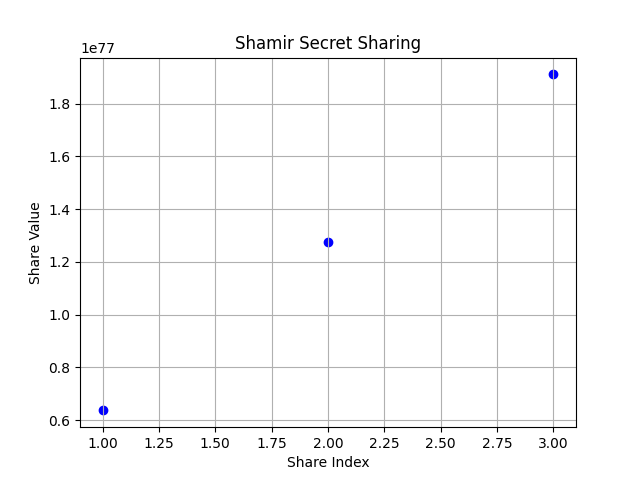

# 🔐 Wallet Security Visualizer

A simple Flask app that visualizes Shamir's Secret Sharing to demonstrate secure private key shard distribution for crypto wallets.

## 🚀 Features

- Split a secret (like a private key) into multiple shares
- Set a threshold to reconstruct it
- Visualize share distribution
- Learn core concepts behind MPC wallets and seed backups

## 🛠️ Tech Stack

- Python
- Flask
- Matplotlib
- Shamir's Secret Sharing (custom implementation)

## 📸 Demo



## 🧪 Run Locally

```bash
git clone https://github.com/yourusername/wallet-security-visualizer.git
cd wallet-security-visualizer
pip install -r requirements.txt
python app.py
